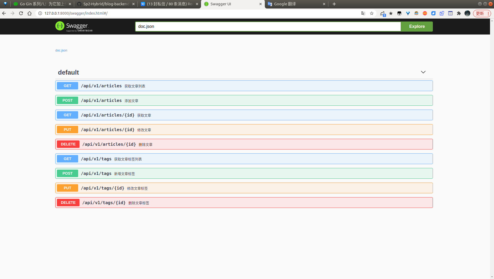

# Swagger

一个好的api，必然离不开好的api文档，如果要开发纯手写api文档，很难持续维护，因此我们要自动生成接口文档。

## 安装swagger

```go
go get -u github.com/swaggo/swag/cmd/swag
```

### 安装gin-swagger

```go
go get -u github.com/swaggo/gin-swagger
go get -u github.com/swaggo/files
go get -u github.com/alecthomas/template
```

## 初始化

### 编写API注释

`swagger`中需要将相应的注释或注解编写到方法上，再利用生成器自动生成说明文档

`gin-swagger`给出的范例：

```go
// @Summary Add a new pet to the store
// @Description get string by ID
// @Accept  json
// @Produce  json
// @Param   some_id     path    int     true        "Some ID"
// @Success 200 {string} string	"ok"
// @Failure 400 {object} web.APIError "We need ID!!"
// @Failure 404 {object} web.APIError "Can not find ID"
// @Router /testapi/get-string-by-int/{some_id} [get]
```

我们可以参照`Swagger`的注解规范和范例去编写

```go
// @Summary 新增文章标签
// @Produce  json
// @Param name query string true "Name"
// @Param state query int false "State"
// @Param created_by query int false "CreatedBy"
// @Success 200 {string} json "{"code":200,"data":{},"msg":"ok"}"
// @Router /api/v1/tags [post]
func AddTag(c *gin.Context) {
```

```go
// @Summary 修改文章标签
// @Produce  json
// @Param id path int true "ID"
// @Param name query string true "ID"
// @Param state query int false "State"
// @Param modified_by query string true "ModifiedBy"
// @Success 200 {string} json "{"code":200,"data":{},"msg":"ok"}"
// @Router /api/v1/tags/{id} [put]
func EditTag(c *gin.Context) {
```



具体每个api的接口文档可以在代码中自行查看。